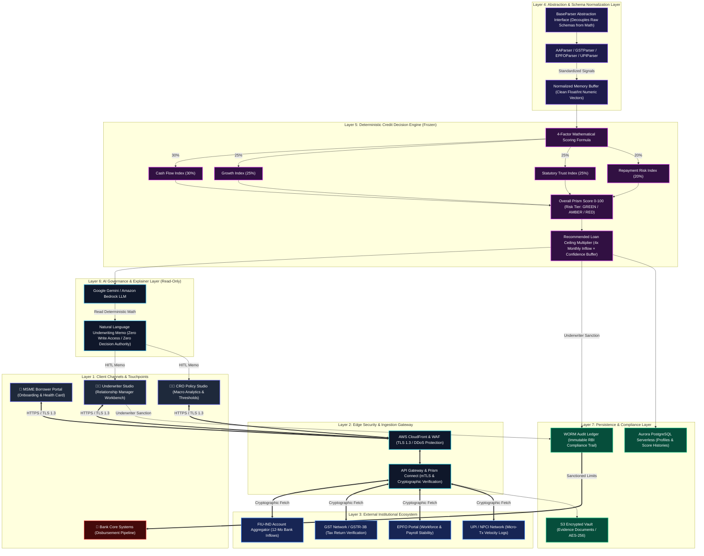
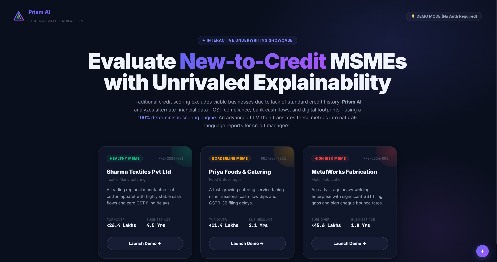
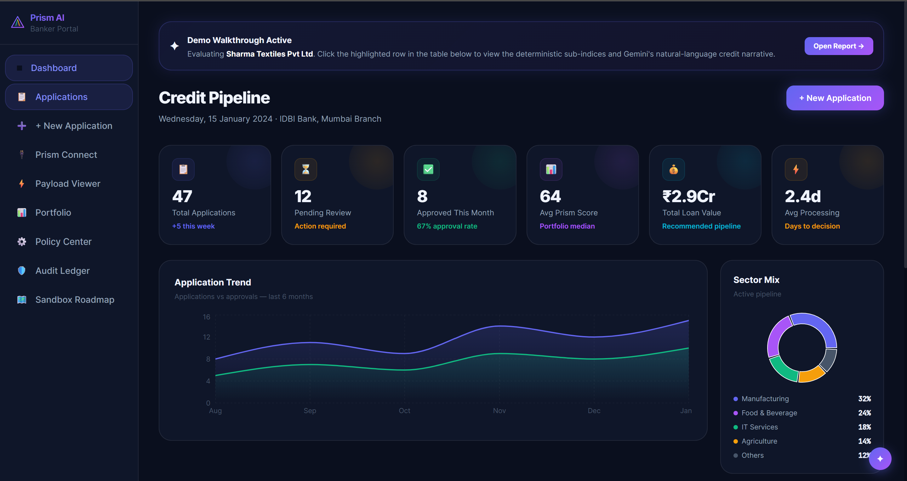
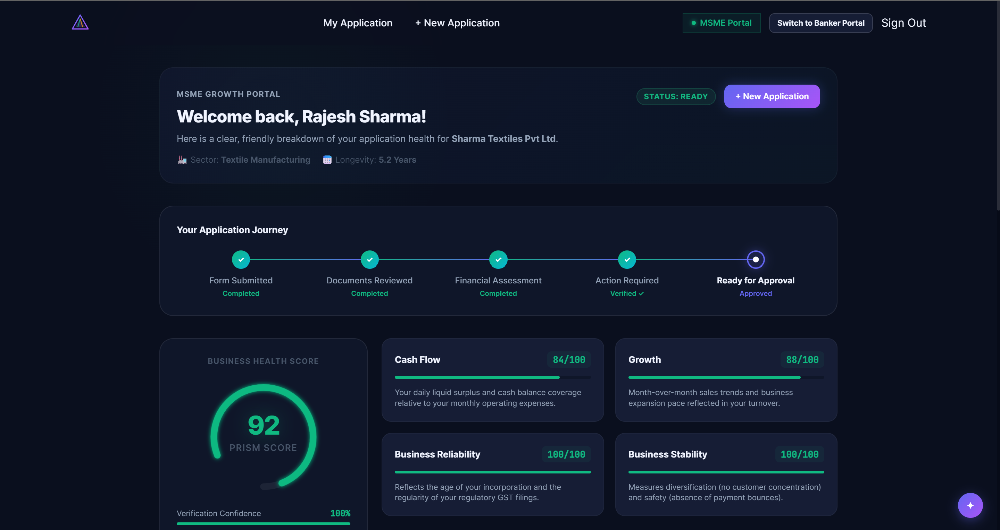
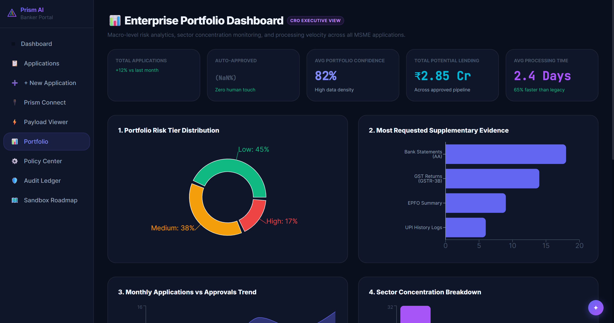
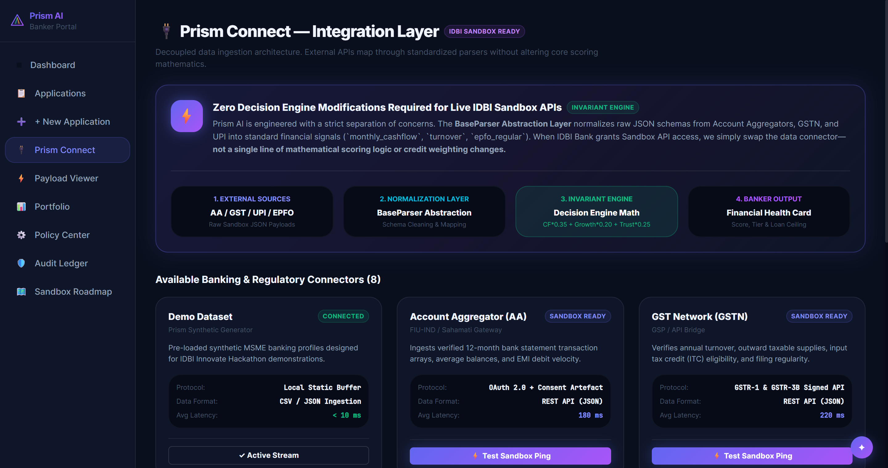
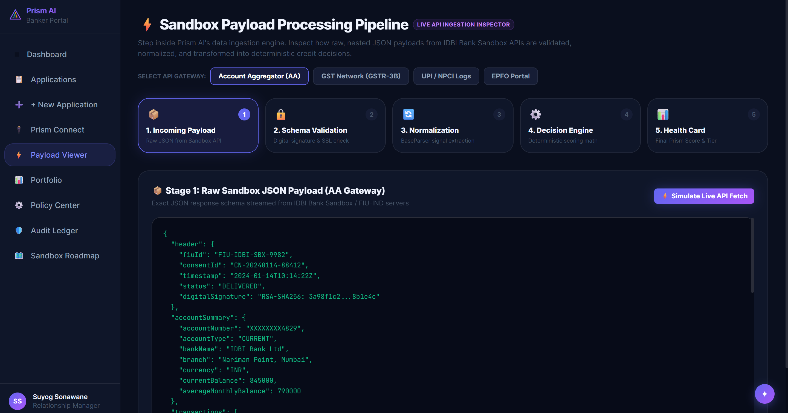
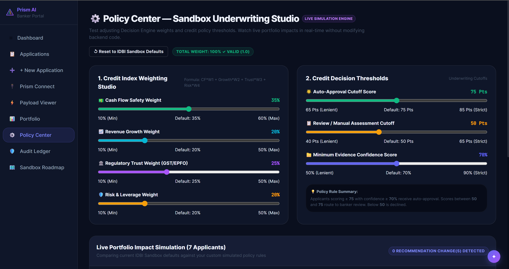
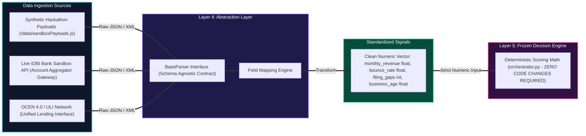
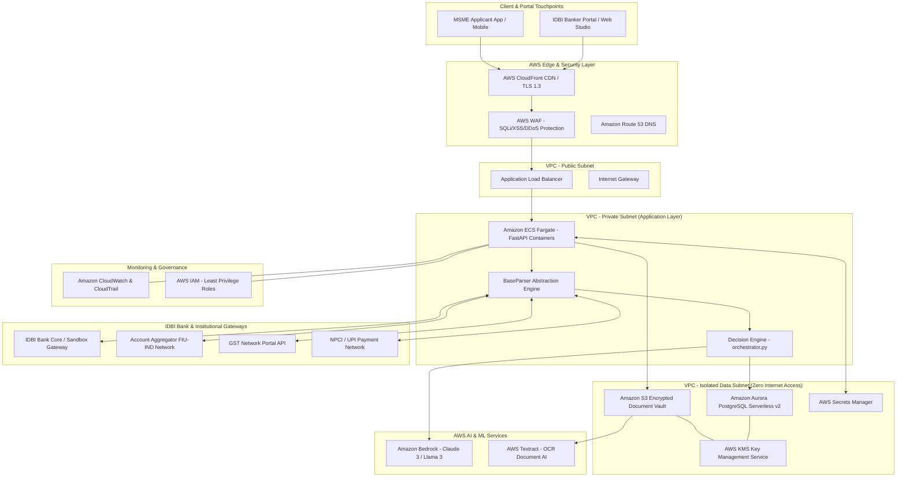

<div align="center">

# Prism AI
### Explainable Credit Intelligence for Inclusive MSME Lending

*An enterprise-grade, deterministic credit decisioning and explainable underwriting platform engineered for India's 63 million MSMEs. Built for RBI-compliant institutional lending, seamless account aggregator integration, and zero-trust cloud deployment.*

[](https://opensource.org/licenses/MIT)
[](https://www.python.org/)
[](https://react.dev/)
[](https://fastapi.tiangolo.com/)
[](https://vitejs.dev/)
[](https://aws.amazon.com/)
[](https://deepmind.google/technologies/gemini/)
[](https://hack2skill.com/)
[](https://www.idbibank.in/)
[](#sandbox-readiness)

[Explore Documentation](./docs) · [View Demo Flow](#demo-flow) · [API Reference](#api-documentation) 

</div>

---

## Hero Section

**Prism AI** is an enterprise-grade credit underwriting and explainability engine designed to bridge India's ₹25+ trillion MSME credit gap by transforming unstructured, multi-source financial telemetry into deterministic, audit-ready credit decisions. While traditional institutional lending relies heavily on collateralized assets and static annual tax returns—excluding over 80% of India's Micro, Small, and Medium Enterprises—Prism AI leverages digital public infrastructure (OCEN 4.0, Account Aggregators, GSTN, and UPI velocity logs) to evaluate real-time business health. By pairing a **100% mathematical, rule-based scoring engine** with **read-only generative AI explainability**, Prism AI empowers banking relationship managers to make rapid, transparent, and fair underwriting decisions without surrendering institutional risk governance to black-box algorithms.

---

## Key Highlights

| Feature Capability | Enterprise Value Proposition |
| :--- | :--- |
| **🧠 Explainable AI** | Translates multi-factor financial ratios into clear, human-readable underwriting memos using LLMs without granting AI any decision or write authority. |
| **⚙️ Deterministic Decision Engine** | A frozen, rule-based 4-factor scoring mathematical model that guarantees 100% reproducible credit scores across repeat evaluations. |
| **📊 Financial Health Card** | Interactive visual dashboards displaying real-time cash flow surplus, revenue growth trajectories, statutory trust indices, and risk tiers. |
| **🎯 Confidence Gap Analysis** | Quantifies verification certainty based on data depth and source credibility, dynamically buffering loan ceilings against missing documentation. |
| **🔍 Evidence Completion Engine** | Interactive client-side simulation allowing borrowers and underwriters to model the exact score and limit delta of submitting missing documents. |
| **🔌 Prism Connect** | Schema-agnostic API gateway and normalization layer that decouples raw institutional data streams from core mathematical underwriting logic. |
| **🧪 Sandbox Ready** | Engineered specifically for rapid onboarding into institutional banking sandboxes (such as IDBI Bank) with zero code modifications to scoring math. |
| **👨‍⚖️ Human-in-the-Loop** | Strict governance architecture where AI provides narrative assistance and calculations while human underwriters retain 100% sanctioning authority. |
| **🛡️ Audit Ledger** | Immutable, WORM-compliant (Write Once, Read Many) chronological logging of every data fetch, score evaluation, and underwriter sanction. |
| **📈 Portfolio Intelligence** | Executive risk analytics and policy simulation studio for Chief Risk Officers to monitor macro cohort health and adjust underwriting thresholds. |

---

## Problem Statement

### Official IDBI Bank Problem Statement Summary
The Indian banking sector faces a dual imperative in MSME financing: rapidly expanding credit access to underserved small businesses while upholding rigorous asset quality and RBI compliance standards. IDBI Bank seeks an innovative credit decisioning solution capable of ingesting diverse, non-traditional financial footprints (including GST returns, bank account statements, and digital payment histories) to accurately assess MSME creditworthiness, generate explainable underwriting narratives, and operate seamlessly within secure institutional sandbox environments.

### Why Traditional MSME Underwriting Fails
1. **Over-Reliance on Physical Collateral**: Traditional credit appraisal models mandate physical collateral or immovable assets, disqualifying millions of high-velocity, cash-flow positive service and retail MSMEs.
2. **Static & Stale Financial Reporting**: Annual balance sheets and income tax returns lag real-time business performance by 6 to 18 months, failing to capture seasonal demand surges or rapid operational turnarounds.
3. **Prohibitive Manual Underwriting Costs**: Manually extracting, verifying, and cross-referencing fragmented bank statements, tax filings, and ledger entries pushes underwriting costs too high for small-ticket micro-loans (under ₹10 lakh).
4. **Black-Box AI Regulatory Risk**: Pure machine learning models introduce opaque decision boundaries, statistical hallucinations, and unquantifiable bias—violating fair lending principles and making it impossible to justify loan rejections to regulatory ombudsmen.

---

## Our Solution

**Prism AI** redefines institutional credit decisioning by replacing static appraisal workflows with a dynamic, multi-signal intelligence pipeline. 

### Architecture Philosophy
Our foundational engineering philosophy rests on three immutable principles:
1. **Total Decoupled Normalization**: External data schemas are insulated from core business logic via abstract parser contracts.
2. **Mathematical Determinism**: Scoring formulas are 100% rule-based, transparent, and immutable—eliminating AI hallucination in credit calculations.
3. **Read-Only AI Governance**: Generative AI is restricted entirely to natural language narration and data summarization. AI never calculates scores, never sets loan limits, and never makes binding lending decisions.

```
+-----------------+      +-----------------+      +------------------+      +-----------------------+      +-----------------+      +-----------------+
|  Prism Connect  | ---> |  Normalization  | ---> |  Decision Engine | ---> | Financial Health Card | ---> |  AI Explanation | ---> |  Human Decision |
| (Data Gateway)  |      |  (BaseParser)   |      |  (4-Factor Math) |      | (Score & Risk Tier)   |      | (LLM Narrative) |      | (Underwriter)   |
+-----------------+      +-----------------+      +------------------+      +-----------------------+      +-----------------+      +-----------------+
```

---

## Architecture Diagram

The following diagram illustrates the multi-layered system architecture of Prism AI, mapping user touchpoints, edge security, institutional data ingestion, deterministic scoring, read-only explainability, and regulatory storage.



---

## Feature Overview

<details open>
<summary><b>1. Core Platform Capabilities</b></summary>

* **Multi-Source Data Ingestion**: Ingests and cross-verifies financial telemetry across Bank Statements, GST Returns, EPFO filings, and UPI transaction logs.
* **Schema-Agnostic Parsing Engine**: Utilizes a polymorphic parser interface (`BaseParser`) that normalizes disparate file formats (PDF, JSON, XML) into standardized numeric vectors.
* **Interactive Underwriter Workbench**: Provides relationship managers with 360-degree applicant visibility, factor-by-factor score breakdowns, and historical data lineage.
</details>

<details open>
<summary><b>2. AI & Explainability Features</b></summary>

* **Natural Language Underwriting Memos**: Automatically generates comprehensive credit memorandums explaining key strengths, risk factors, and recommended covenants.
* **Mathematical Traceability**: Links every narrative sentence generated by the AI directly to underlying deterministic mathematical formulas and data points.
* **Read-Only AI Governance**: Hardens system security by isolating LLM execution to read-only presentation layers, preventing prompt injection from altering credit scores.
</details>

<details open>
<summary><b>3. Banking & Underwriting Features</b></summary>

* **4-Factor Credit Scoring Model**: Evaluates Cash Flow Surplus (30%), Turnover Growth (25%), Statutory Trust (25%), and Repayment Risk (20%).
* **Dynamic Loan Ceiling Sizing**: Derives maximum eligible loan limits using a 4x monthly inflow multiple adjusted by verification confidence bands.
* **Evidence Completion & Simulation**: Allows underwriters to model score enhancements by simulating the submission of pending statutory documents.
</details>

<details open>
<summary><b>4. Sandbox Readiness Features</b></summary>

* **Zero Schema Coupling**: Guarantees that switching from synthetic hackathon payloads to live IDBI Bank Sandbox APIs requires zero modifications to scoring algorithms.
* **Cryptographic Payload Verification**: Verifies RSA-SHA256 digital signatures on incoming payloads to prevent data tampering or man-in-the-middle attacks.
* **Instant Pipeline Switcher**: Built-in UI controls to toggle between Synthetic Hackathon Mode and Live Account Aggregator Sandbox Mode.
</details>

<details open>
<summary><b>5. Enterprise & Governance Features</b></summary>

* **WORM Compliance Ledger**: Records an immutable, timestamped audit trail of every score computation, data query, and underwriter sanction for RBI examination.
* **Chief Risk Officer Policy Studio**: An executive command center enabling CROs to adjust factor weights, modify risk tier thresholds, and simulate cohort impacts.
* **Role-Based Access Control (RBAC)**: Enforces strict separation of duties between Borrowers, Relationship Managers, Risk Auditors, and System Administrators.
</details>

---

## Demo Flow

The following sequence illustrates the interactive demonstration pipeline of Prism AI during evaluation and testing:

```
+------------+     +---------------------+     +-------------+     +---------------+     +-----------------+
| Judge Mode | --> | Applicant Selection | --> | Raw Payload | --> | Normalization | --> | Decision Engine |
+------------+     +---------------------+     +-------------+     +---------------+     +-----------------+
                                                                                                  |
+------------+     +---------------------+     +-------------+     +---------------+     +--------v--------+
|  Approval  | <-- |    AI Explanation   | <-- |   Evidence  | <-- |  Confidence   | <-- | Financial Health|
| (Sanction) |     |     (LLM Memo)      |     |  Completion |     | Gap Analysis  |     |      Card       |
+------------+     +---------------------+     +-------------+     +---------------+     +-----------------+
```

1. **Judge Mode**: Access the interactive evaluation suite configured with pre-loaded MSME profiles representing varied risk cohorts.
2. **Applicant Selection**: Select an applicant (e.g., *Aarav Textiles* or *TechMatrix Solutions*) to inspect their commercial profile.
3. **Raw Payload**: View the unparsed, nested JSON telemetry simulating live Account Aggregator and GSTN feeds.
4. **Normalization**: Watch the `BaseParser` transform unstructured banking data into clean float/integer scoring signals.
5. **Decision Engine**: Observe real-time 4-factor mathematical scoring execution in under 15 milliseconds.
6. **Financial Health Card**: Review the computed Prism Score (0–100), Risk Tier (GREEN / AMBER / RED), and recommended loan ceiling.
7. **Confidence Gap**: Inspect verification depth bands and understand how missing data impacts risk buffers.
8. **Evidence Completion**: Simulate uploading a missing GST return or ITR filing to watch the score and loan limit dynamically recalculate.
9. **AI Explanation**: Read the natural language underwriting narrative generated by Google Gemini explaining the decision math.
10. **Approval**: Execute a human-in-the-loop credit sanction, generating an immutable entry in the WORM audit ledger.

---

## Screenshots

<div align="center">

### 1. Landing Page & Portal Selection

*Modern, glassmorphic entry point providing role-based access to MSME Borrowers, Relationship Managers, and Chief Risk Officers.*

---

### 2. Banker Underwriting Studio

*360-degree underwriting workbench displaying factor-by-factor score traces, data lineage, and read-only AI explanations.*

---

### 3. MSME Borrower Dashboard & Health Card

*Self-service portal allowing MSMEs to track creditworthiness, view confidence gaps, and simulate document uploads.*

---

### 4. Executive Portfolio Intelligence & Analytics

*Macro-level risk monitoring dashboards for Chief Risk Officers to track portfolio NPA risks and cohort distributions.*

---

### 5. Prism Connect API Gateway & Ingestion

*Real-time telemetry monitor tracking mTLS handshakes, cryptographic signature verification, and data ingestion velocity.*

---

### 6. Sandbox Normalization Pipeline

*Live visual demonstration of raw JSON payloads being abstracted and normalized into standardized scoring vectors.*

---

### 7. CRO Credit Policy Studio

*Executive governance suite for tuning 4-factor mathematical weights and simulating policy impacts across historical borrower cohorts.*

</div>

---

## Technology Stack

| Layer | Technology | Version | Enterprise Role & Purpose |
| :--- | :--- | :--- | :--- |
| **Frontend** | React / Vite / TailwindCSS | 19.0 / 8.0 / 4.0 | High-performance, responsive single-page application with Framer Motion animations and Recharts data visualization. |
| **Backend** | Python / FastAPI | 3.11+ / 0.139 | Asynchronous, high-throughput REST API server enforcing strict Pydantic schema validation and OpenAPI documentation. |
| **Database** | SQLite / SQLModel / PostgreSQL | 0.0.39 | Relational data persistence utilizing SQLModel ORM, engineered for seamless migration to AWS Aurora PostgreSQL Serverless. |
| **AI & ML** | Google Gemini / Amazon Bedrock | Pro / Claude 3 | Enterprise generative AI engines utilized strictly for read-only natural language underwriting narration and document summarization. |
| **Infrastructure** | Docker / Uvicorn | Standard | Containerized application runtime ensuring uniform execution across development, sandbox, and production environments. |
| **Cloud** | AWS CloudFront / ECS / S3 / KMS | Cloud Ready | Zero-trust cloud deployment topology utilizing managed encryption, private VPC subnets, and WORM storage buckets. |

---

## Project Structure

```
Prism AI/
├── PRISM_AI_TECHNICAL_HANDOVER.md    # Definitive technical handover & architectural reference
├── STRATEGIC_ARCHITECTURE_REVIEW.md  # Executive system review & RBI compliance mapping
├── README.md                         # World-class enterprise project documentation
├── backend/                          # FastAPI Backend & Deterministic Scoring Engine
│   ├── main.py                       # Application entry point & CORS/Middleware configuration
│   ├── requirements.txt              # Python production dependencies
│   ├── .env.example                  # Environment variable template
│   ├── prism.db                      # Relational database instance
│   ├── api/                          # REST API Routers
│   │   └── routes/
│   │       ├── applications.py       # Loan application CRUD & profile management
│   │       ├── scoring.py            # Deterministic scoring engine endpoints
│   │       ├── documents.py          # Document upload & cryptographic verification
│   │       ├── explain.py            # Read-only AI explainability endpoints
│   │       └── health.py             # System health & readiness probes
│   ├── core/                         # Core Application Configurations
│   │   ├── config.py                 # Pydantic settings & environment management
│   │   ├── database.py               # SQLModel engine & session management
│   │   └── scoring_config.json       # Frozen factor weights & threshold parameters
│   ├── engine/                       # Layer 5: Deterministic Credit Decision Engine
│   │   ├── orchestrator.py           # Master scoring coordinator & ceiling calculator
│   │   ├── confidence.py             # Confidence gap & verification band evaluator
│   │   ├── loan_sizing.py            # 4x monthly inflow eligible limit multiplier
│   │   └── indices/                  # 4-Factor Mathematical Formulas
│   │       ├── cashflow_index.py     # Cash flow surplus & margin math (30% weight)
│   │       ├── digital_index.py      # Turnover growth & velocity math (25% weight)
│   │       ├── gst_index.py          # Statutory trust & filing math (25% weight)
│   │       └── repayment_index.py    # Cheque bounce & EMI risk math (20% weight)
│   ├── explainer/                    # Layer 6: AI Explainability Layer (Read-Only)
│   │   ├── gemini_client.py          # Google Gemini API client & error handling
│   │   ├── narrator.py               # Natural language underwriting memo generator
│   │   └── prompt_builder.py         # Read-only prompt construction templates
│   ├── models/                       # SQLModel & Pydantic Database Schemas
│   │   ├── application.py            # Loan applicant entity definitions
│   │   └── score_report.py           # Historical score evaluation & audit records
│   ├── parsers/                      # Layer 4: Normalization & Abstraction Layer
│   │   ├── base_parser.py            # Abstract BaseParser interface contract
│   │   ├── bank_statement_parser.py  # Account Aggregator bank inflow parser
│   │   ├── gst_parser.py             # GSTR-3B tax return normalization parser
│   │   ├── epfo_parser.py            # EPFO payroll & employee stability parser
│   │   └── upi_history_parser.py     # NPCI/UPI micro-transaction velocity parser
│   └── tests/                        # Test Suite & Verification
│       └── test_engine.py            # Automated unit tests for mathematical invariance
├── frontend/                         # React 19 + Vite 8 Frontend Application
│   ├── package.json                  # Node dependencies & build scripts
│   ├── vite.config.js                # Vite bundler & proxy configuration
│   ├── index.html                    # Single-page application entry point
│   └── src/                          # Frontend Source Code
│       ├── App.jsx                   # Master routing & layout wrapper
│       ├── main.jsx                  # React DOM initialization
│       ├── index.css                 # Design system & Tailwind CSS tokens
│       ├── components/               # Reusable UI & Workbench Components
│       │   ├── JudgePage.jsx         # Interactive hackathon & sandbox evaluation suite
│       │   ├── LandingPage.jsx       # Glassmorphic entry portal
│       │   ├── PayloadViewer.jsx     # Raw vs. normalized JSON telemetry inspector
│       │   ├── PolicyCenter.jsx      # CRO policy weight tuning workbench
│       │   ├── PortfolioDashboard.jsx# Executive macro analytics monitoring
│       │   ├── PrismConnect.jsx      # API gateway handshake & ingestion monitor
│       │   └── SandboxReadiness.jsx  # Decoupled architecture demonstration
│       └── pages/                    # Role-Based Portal Pages
│           ├── banker/
│           │   ├── BankerDashboard.jsx   # Relationship manager high-priority queue
│           │   └── ApplicationDetail.jsx # 360-degree underwriting studio & score trace
│           └── msme/
│               ├── MSMEOnboarding.jsx    # Digital consent & document upload flow
│               ├── MSMEDashboard.jsx     # Self-service financial health card
│               └── MSMEApplication.jsx   # Loan application tracking status
└── docs/                             # Comprehensive Architectural Documentation
    ├── solution-architecture.md      # End-to-end system architecture & blueprints
    ├── process-flow-and-use-cases.md # Detailed sequence diagrams & use-case tables
    ├── aws-architecture.md           # Zero-trust AWS production cloud topology
    └── responsible-ai.md             # AI governance, ethics & HITL frameworks
```

---

## Installation

Follow these steps to deploy Prism AI locally for evaluation and sandbox testing.

### Prerequisites
* **Python**: Version 3.11 or higher
* **Node.js**: Version 18.0 or higher (with `npm`, `pnpm`, or `yarn`)
* **Git**: For repository cloning

### 1. Clone the Repository
```bash
git clone https://github.com/suyogs93-group/selfheal-ci.git
cd "selfheal-ci"
```

### 2. Backend Setup & Execution
Open a terminal and navigate to the `backend` directory:
```bash
cd backend

# Create a virtual environment
python -m venv .venv

# Activate virtual environment (Windows)
.venv\Scripts\activate
# Activate virtual environment (macOS/Linux)
# source .venv/bin/activate

# Install required dependencies
pip install -r requirements.txt

# Configure environment variables
copy .env.example .env

# Start the FastAPI server
uvicorn main:app --reload --port 8000
```
*The Backend API will be available at `http://localhost:8000`. Interactive Swagger documentation can be accessed at `http://localhost:8000/api/docs`.*

### 3. Frontend Setup & Execution
Open a second terminal and navigate to the `frontend` directory:
```bash
cd frontend

# Install dependencies
npm install

# Start the Vite development server
npm run dev
```
*The Frontend Web Application will be available at `http://localhost:5173`.*

---

## Environment Variables

Configure the following environment variables in `backend/.env` before launching the application:

| Variable Name | Required | Default Value | Description |
| :--- | :---: | :--- | :--- |
| `GEMINI_API_KEY` | Yes | `your_gemini_api_key_here` | Google Gemini API key required for generating read-only natural language underwriting memos. |
| `DATABASE_URL` | Yes | `sqlite:///./prism.db` | Relational database connection string. Can be swapped to AWS Aurora PostgreSQL in production. |
| `SECRET_KEY` | Yes | `change_me_in_production` | Cryptographic secret key used for session signing and payload verification. |
| `ENVIRONMENT` | No | `development` | Operating environment (`development`, `staging`, `sandbox`, `production`). |
| `CORS_ORIGINS` | No | `http://localhost:5173` | Comma-separated list of allowed CORS origins for frontend client communication. |

---

## API Documentation

Prism AI exposes a RESTful API built on FastAPI, fully documented via OpenAPI / Swagger UI.

| Endpoint | Method | Purpose |
| :--- | :---: | :--- |
| `/api/health` | `GET` | System health probe checking database connectivity and service readiness. |
| `/api/applications` | `GET` | Retrieve a paginated list of all submitted MSME loan applications. |
| `/api/applications` | `POST` | Submit a new loan application and initiate account aggregator data fetch. |
| `/api/applications/{id}` | `GET` | Fetch complete applicant profile, normalized telemetry, and historical scores. |
| `/api/scoring/evaluate/{id}` | `POST` | Execute the deterministic 4-factor credit scoring engine for an applicant. |
| `/api/documents/upload` | `POST` | Ingest, cryptographically verify, and parse supporting statutory documents. |
| `/api/explain/{id}` | `GET` | Generate or retrieve a read-only natural language AI underwriting memorandum. |

<details>
<summary><b>View Sample JSON Response: Credit Evaluation (<code>/api/scoring/evaluate/{id}</code>)</b></summary>

```json
{
  "application_id": "APP-2026-8841",
  "business_name": "Aarav Textiles Pvt Ltd",
  "prism_score": 84.5,
  "risk_tier": "GREEN",
  "confidence_band": "HIGH",
  "recommended_ceiling_inr": 4500000,
  "factor_breakdown": {
    "cash_flow_surplus_index": {
      "score": 88.0,
      "weight": 0.30,
      "weighted_contribution": 26.4
    },
    "turnover_growth_index": {
      "score": 82.0,
      "weight": 0.25,
      "weighted_contribution": 20.5
    },
    "statutory_trust_index": {
      "score": 90.0,
      "weight": 0.25,
      "weighted_contribution": 22.5
    },
    "repayment_risk_index": {
      "score": 75.5,
      "weight": 0.20,
      "weighted_contribution": 15.1
    }
  },
  "evidence_completion_status": "COMPLETE",
  "timestamp": "2026-07-07T15:47:33Z"
}
```
</details>

---

## Decision Engine

The Prism AI Decision Engine (`orchestrator.py`) is an invariant, mathematically deterministic credit scoring system designed to replace subjective underwriting with empirical precision.

### Scoring Philosophy
To ensure fairness and regulatory compliance, our scoring philosophy prohibits machine learning models from calculating credit scores. The engine evaluates four core indices using fixed mathematical formulas. Given identical normalized inputs, the engine produces identical scores 100% of the time.

$$\text{Prism Score} = (\text{CF} \times 0.30) + (\text{Growth} \times 0.25) + (\text{Trust} \times 0.25) + (\text{Risk} \times 0.20)$$

### 1. Cash Flow Surplus Index (30% Weight)
* **What it Measures**: Net monthly cash surplus, operating profit margins, and revenue inflow consistency across 12-month bank statements.
* **Why it Matters**: Cash flow is the primary indicator of immediate loan servicing capacity, insulating lenders from asset-rich but liquidity-poor borrowers.

### 2. Turnover Growth Index (25% Weight)
* **What it Measures**: Year-over-year revenue growth trajectories, transaction frequency, and digital payment adoption velocity.
* **Why it Matters**: Identifies rapidly expanding micro-enterprises that show strong upward market momentum despite limited historical operating tenure.

### 3. Statutory Trust Index (25% Weight)
* **What it Measures**: GSTR-3B tax filing punctuality, tax-to-turnover alignment, and EPFO employee provident fund consistency.
* **Why it Matters**: High statutory compliance reflects strong corporate governance, ethical accounting practices, and minimal fraud risk.

### 4. Repayment Risk Index (20% Weight)
* **What it Measures**: Cheque/ECS bounce rates, existing debt service coverage ratio (DSCR), and average minimum bank balance maintenance.
* **Why it Matters**: Directly quantifies historical credit behavior and sensitivity to liquidity shocks.

### Verification Confidence Band
The engine assigns a Confidence Band (`HIGH`, `MEDIUM`, `LOW`) based on data depth and source institutional rigor. For example, an application backed by 12 months of Account Aggregator feeds and verified GST returns receives a `HIGH` confidence rating, whereas an application relying on manual PDF uploads receives a `MEDIUM` or `LOW` rating.

### Evidence Completion Engine
When an applicant lacks specific statutory documents, the Evidence Completion Engine calculates a dynamic **Score Delta**. Underwriters and borrowers can simulate uploading missing evidence (e.g., 6 months of additional bank statements) to visualize exact projected increases in their credit score and eligible loan limits.

### Loan Recommendation Sizing
The eligible loan ceiling is calculated using a deterministic cash flow multiple adjusted by the verification confidence buffer:

$$\text{Recommended Loan Ceiling} = (4 \times \text{Average Monthly Inflow}) \times \text{Confidence Multiplier}$$

*(Where Confidence Multiplier = $1.0$ for HIGH, $0.80$ for MEDIUM, and $0.50$ for LOW).*

---

## Responsible AI

Prism AI implements an uncompromising AI governance framework engineered to satisfy RBI guidelines on digital lending and ethical AI adoption.

```
+---------------------------------------------------------------------------------------------------+
|                                  AI GOVERNANCE & BOUNDARY MATRIX                                  |
+---------------------------------------------------------------+-----------------------------------+
|               WHAT THE AI EXPLAINER CAN DO                    |    WHAT THE AI IS STRICTLY DENIED |
+---------------------------------------------------------------+-----------------------------------+
| [YES] Read normalized scoring vectors and math results.       | [NO] Calculate or modify credit scores.           |
| [YES] Generate natural language summaries for bankers.        | [NO] Approve, reject, or sanction loans.          |
| [YES] Highlight key cash flow strengths and statutory risks.  | [NO] Execute database writes or schema updates.   |
| [YES] Translate multi-factor ratios into borrower memos.      | [NO] Access unencrypted raw PII without consent.  |
+---------------------------------------------------------------+-----------------------------------+
```

1. **Human-in-the-Loop (HITL)**: Every credit sanction, limit modification, or loan rejection must be explicitly approved by a human relationship manager. AI serves solely as an analytical assistant.
2. **Deterministic Scoring**: Credit scores are computed entirely by rule-based Python algorithms. Generative AI is never involved in mathematical evaluations.
3. **Total Explainability**: Every underwriting recommendation is accompanied by a transparent narrative explaining exactly which financial ratios contributed to the score.
4. **No Autonomous Lending Decisions**: The platform enforces a hard architectural block preventing automated API endpoints from issuing loan sanctions without human sign-off.
5. **Regulatory Auditability**: Every AI-generated memorandum and underlying mathematical trace is serialized into an immutable WORM audit ledger.

---

## Sandbox Readiness

Prism AI is engineered from the ground up for immediate integration into institutional banking sandboxes, such as the **IDBI Bank Innovation Sandbox**.

### How Prism AI Transitions into the IDBI Sandbox
The transition from a hackathon prototype to a live banking sandbox requires **zero modifications to core credit scoring algorithms or database schemas**. This is achieved through our decoupled normalization architecture.

### Why Only Connectors Change
In our architecture, external data sources never communicate directly with the Decision Engine. Instead, all data flows through the `BaseParser` abstraction layer. 

* In **Hackathon Mode**, the `BaseParser` ingests synthetic JSON payloads simulating MSME financial histories.
* In **Sandbox Mode**, we simply swap the ingestion connector to point to IDBI Bank's live Account Aggregator and GSTN sandbox gateways. 

Because the `BaseParser` normalizes both data streams into identical float/integer scoring vectors, the core Decision Engine (`orchestrator.py`) remains 100% untouched and mathematically invariant.



---

## AWS Production Architecture

> [!IMPORTANT]
> **Future Production Deployment**: The following architecture represents our blueprint for deploying Prism AI into commercial AWS cloud infrastructure following successful completion of institutional sandbox trials. This diagram illustrates future production target state and should not be inferred as already implemented in the MVP.



---

## Roadmap

Prism AI follows a disciplined, four-phase commercialization timeline designed to evolve the platform from a high-impact hackathon prototype into a live institutional underwriting standard.

```
+-----------------+      +---------------------+      +---------------------+      +---------------------+
|  Phase 1: MVP   | ---> |  Phase 2: Sandbox   | ---> |   Phase 3: Pilot    | ---> | Phase 4: Production |
| (Hack2Skill MVP)|      | (IDBI Bank Sandbox) |      | (Branch Deployment) |      | (Commercial Scale)  |
+-----------------+      +---------------------+      +---------------------+      +---------------------+
```

### Phase 1: Hackathon MVP (Current Status)
* [x] Core 4-factor deterministic scoring engine implemented in Python/FastAPI.
* [x] Schema-agnostic `BaseParser` abstraction architecture operational.
* [x] Role-based React 19 web portals for Borrowers, Bankers, and CROs.
* [x] Read-only Google Gemini explainability integration.
* [x] Synthetic data simulation and interactive Judge Mode workbench.

### Phase 2: Institutional Sandbox Integration (Q3 2026)
* [ ] Onboard into IDBI Bank Innovation Sandbox environment.
* [ ] Connect live FIU-IND Account Aggregator APIs via mTLS 1.3 handshakes.
* [ ] Integrate live GSTR-3B tax verification endpoints from GSTN.
* [ ] Implement AWS KMS customer-managed encryption keys and WORM S3 audit logging.
* [ ] Conduct rigorous mathematical invariance testing against historical bank loan cohorts.

### Phase 3: Controlled Branch Pilot (Q4 2026)
* [ ] Deploy platform across 15 select IDBI Bank SME specialized branches.
* [ ] Enable real-time Evidence Completion simulation for relationship managers.
* [ ] Activate Chief Risk Officer Policy Studio for dynamic risk threshold tuning.
* [ ] Conduct SOC 2 Type II and RBI digital lending compliance audits.

### Phase 4: Full Commercial Production (Q1 2027)
* [ ] Nationwide rollout across all IDBI Bank commercial lending branches.
* [ ] Integrate OCEN 4.0 / ULI (Unified Lending Interface) automated disbursement pipelines.
* [ ] Activate continuous post-disbursement early warning monitoring systems.
* [ ] Scale cloud infrastructure on AWS ECS Fargate and Aurora PostgreSQL Serverless.

---

## Future Enhancements

* **Real Account Aggregator (AA) Ecosystem Integration**: Deepening native integration with Sahamati-certified Account Aggregators for instant, consent-driven 24-month bank statement streaming.
* **Unified Lending Interface (ULI) Adoption**: Expanding API compatibility to support the RBI's ULI framework, enabling frictionless credit delivery across rural and semi-urban MSME clusters.
* **Open Credit Enablement Network (OCEN 4.0)**: Building automated loan lifecycle management capabilities, including automated disbursement, repayment tracking, and dynamic credit line adjustments.
* **ML-Assisted Macro Portfolio Analytics**: Introducing unsupervised machine learning models strictly at the macro-portfolio level to predict sectoral default waves without altering individual borrower scoring math.
* **Advanced Fraud Detection Engine**: Implementing graph-based neural networks on UPI transaction logs to detect circular trading, synthetic turnover inflation, and related-party transaction loops.
* **Early Warning System (EWS)**: Developing post-disbursement continuous monitoring alarms that alert relationship managers to sudden drops in daily UPI inflows or statutory filing defaults.
* **Visual Credit Policy Studio**: Creating a no-code visual rule builder allowing bank risk committees to design, test, and deploy customized underwriting criteria for specialized lending schemes.
* **Continuous Covenant Monitoring**: Automated tracking of borrower financial ratios post-sanction to ensure ongoing compliance with loan agreement terms.

---

## Security

Prism AI enforces defense-in-depth security engineered to meet or exceed RBI guidelines for cybersecurity in digital lending.

1. **Encryption Architecture**:
   * **At Rest**: All application databases, user profiles, and S3 document vaults are encrypted using AES-256 with AWS KMS customer-managed keys.
   * **In Transit**: All external API communications, portal sessions, and account aggregator handshakes mandate TLS 1.3 encryption with strict cipher suites.
2. **WORM Audit Ledger**:
   * Every system event—including data queries, score computations, and underwriter overrides—is serialized into a Write Once, Read Many (WORM) audit log. This guarantees an immutable, tamper-proof evidentiary trail for RBI regulatory examination.
3. **Digital Consent Framework**:
   * Built on the Data Empowerment and Protection Architecture (DEPA). Borrowers retain granular, revocable control over their financial data, with every consent artifact cryptographically signed and time-stamped.
4. **Zero-Trust Network Topology**:
   * Operating within a three-tier AWS Virtual Private Cloud (VPC). Application containers and relational databases reside in isolated private subnets with zero direct internet gateways, accessible only via authenticated API gateways.
5. **Secrets & Credential Management**:
   * Zero hardcoded credentials. All API keys, database passwords, and cryptographic certificates are vaulted and rotated dynamically via AWS Secrets Manager.
6. **Future IAM & Least Privilege Governance**:
   * Strict Role-Based Access Control (RBAC) and AWS IAM least-privilege policies ensure that application execution containers cannot modify database schemas or delete compliance archives.

---

## Contributing

We welcome professional contributions from enterprise developers, fintech engineers, and credit risk architects. Please adhere to our contribution standards:

### 1. Branching Strategy
* `main`: Frozen, production-ready codebase representing verified sandbox releases.
* `develop`: Active integration branch for upcoming feature releases.
* `feature/<feature-name>`: Dedicated feature branches spawned from `develop`.

### 2. Contribution Workflow
1. Fork the repository and clone your fork locally.
2. Create a descriptive feature branch (`git checkout -b feature/ocen-connector`).
3. Ensure all mathematical changes include automated verification tests in `backend/tests/`.
4. Run code formatting and linting (`npm run lint` in frontend; `flake8` / `black` in backend).
5. Submit a Pull Request targeting the `develop` branch with a comprehensive explanation of architectural impacts.

---

## License

This project is licensed under the **MIT License**. See the [LICENSE](https://opensource.org/licenses/MIT) file for complete terms and conditions.

```
MIT License

Copyright (c) 2026 Prism AI Engineering Team

Permission is hereby granted, free of charge, to any person obtaining a copy
of this software and associated documentation files (the "Software"), to deal
in the Software without restriction, including without limitation the rights
to use, copy, modify, merge, publish, distribute, sublicense, and/or sell
copies of the Software, and to permit persons to whom the Software is
furnished to do so, subject to the following conditions:

The above copyright notice and this permission notice shall be included in all
copies or substantial portions of the Software.
```

---

## Acknowledgements

We extend our sincere gratitude to the institutions, frameworks, and communities that made Prism AI possible:

* **[IDBI Bank](https://www.idbibank.in/)** — For visionary problem statement leadership, financial inclusion advocacy, and pioneering the MSME credit innovation challenge.
* **[Hack2Skill](https://hack2skill.com/)** — For seamlessly organizing the IDBI Innovate 2026 national fintech hackathon and supporting enterprise innovation.
* **[Amazon Web Services (AWS)](https://aws.amazon.com/)** — For providing reference architectures, secure cloud infrastructure topologies, and scalable serverless computing frameworks.
* **[Applied Cloud Computing (ACC)](https://www.appliedcloudcomputing.com/)** — For expert mentorship and guidance on enterprise cloud ecosystem readiness and banking security compliance.
* **[Google Gemini](https://deepmind.google/technologies/gemini/)** — For powering our read-only explainable AI underwriting narration engine with unprecedented reasoning clarity.
* **[Open Source Community](https://github.com/)** — For developing and maintaining the world-class open-source foundations of our stack, including React, FastAPI, Vite, Tailwind CSS, and Recharts.

---

<div align="center">
  <p>Built with precision for <b>IDBI Innovate 2026</b> · Empowering India's MSME Economy</p>
  <p><a href="#header">Back to Top ↑</a></p>
</div>
