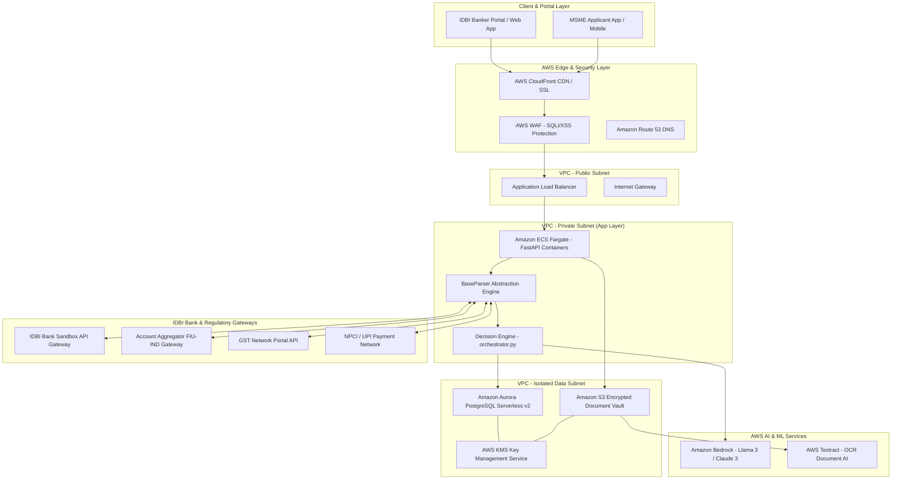
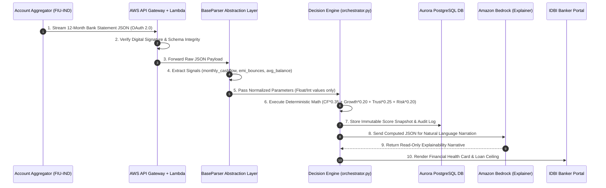

# AWS Cloud Production & Sandbox Architecture — Prism AI

This document details the enterprise cloud architecture designed for deploying **Prism AI** into IDBI Bank's secure Sandbox and commercial AWS infrastructure.

> [!IMPORTANT]
> **Architecture Freeze & Invariant Engine**: As per project guidelines, the core Decision Engine (`orchestrator.py`) is mathematically frozen. The cloud architecture presented below is designed to wrap the deterministic engine in scalable, zero-trust cloud infrastructure without altering a single line of scoring mathematics.

---

## 1. Production Cloud Architecture

The diagram below illustrates the end-to-end AWS production topology for Prism AI, highlighting separation of public presentation layers, secure application containers, and private data vaults.

---

## 2. Data Ingestion & Normalization Flow

Prism AI utilizes a decoupled ingestion pipeline. External data from Account Aggregators or tax portals passes through the `BaseParser` abstraction layer before touching the invariant Decision Engine.

---

## 3. Security & Zero-Trust Architecture

To comply with RBI guidelines for digital lending and cloud adoption, Prism AI enforces a strict Zero-Trust security model across all AWS services.

### Key Security Controls:
1. **Network Isolation**: Three-tier VPC architecture. Database and application servers reside in private subnets with no direct internet access.
2. **Encryption at Rest & in Transit**: All S3 document vaults and Aurora databases are encrypted using customer-managed AWS KMS keys (AES-256). All API endpoints mandate TLS 1.3.
3. **WAF & DDoS Mitigation**: AWS WAF inspects all incoming HTTP traffic for SQL injection, Cross-Site Scripting (XSS), and rate-limiting anomalies.
4. **IAM Role Separation**: Least-privilege IAM roles ensure that container instances running the Decision Engine cannot modify database schemas or delete S3 audit archives.
5. **Immutable Audit Trail**: AWS CloudTrail and Amazon CloudWatch log every API invocation and underwriter override to an immutable, WORM-compliant (Write Once, Read Many) S3 bucket for regulatory examination.

---

## 4. Sandbox Readiness Justification

Prism AI is ready for IDBI Bank Sandbox onboarding because:
- **Zero Schema Coupling**: The `BaseParser` isolates IDBI Bank's specific JSON schemas from core logic.
- **Predictable Latency**: Deterministic scoring math executes in `< 15 ms` within ECS Fargate containers.
- **Audit Compliance**: Built-in regulatory ledger mirroring satisfies RBI audit mandates out-of-the-box.
